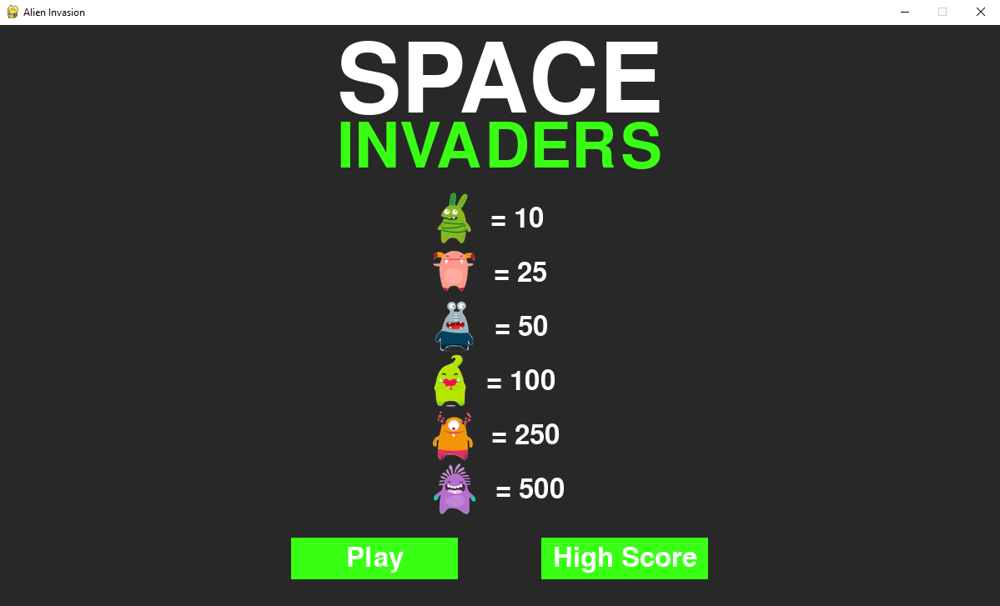
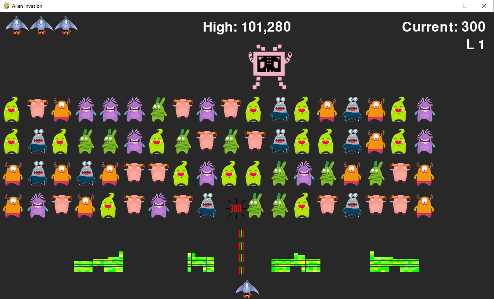

# Space Invaders Game

Dive into the nostalgic realm of arcade games with this Python-based Space Invaders clone. Utilizing the Pygame library, this project is a tribute to the classic Space Invaders arcade game, offering a blend of retro gaming with modern programming.




## Overview

This Space Invaders game is developed using Python and Pygame, aiming to replicate the classic gameplay experience. Players control a spaceship, dodging and destroying incoming alien ships, striving to achieve the highest score while defending against a pixelated alien invasion.

## How to Play

- Use mouse to start a new game.
- Use the **arrow keys** on your keyboard to move the ship up, down, left, or right.
- Use the **space bar** to shoot lasers.
- To quit the game, press the **Q** key or close the game window.

## Game Rules

- Destroy all the alien ships to advance to the next level.
- Avoid collisions with alien lasers and alien ships.
- Hit UFO for extra points.

### Prerequisites

- Python 3.x installed on your system.
- Pygame library installed. If you don't have Pygame installed, you can install it using pip:

```bash
  pip install -r requirements.txt
```

## Getting Started

1. Clone the repository to your local machine:

   ```bash
   git clone https://github.com/edwinperaza99/space-invaders.git
   ```

2. Navigate to the game's repository:

   ```bash
   cd space-invaders
   ```

3. Run the game:

   ```bash
   python3 game.py
   ```
